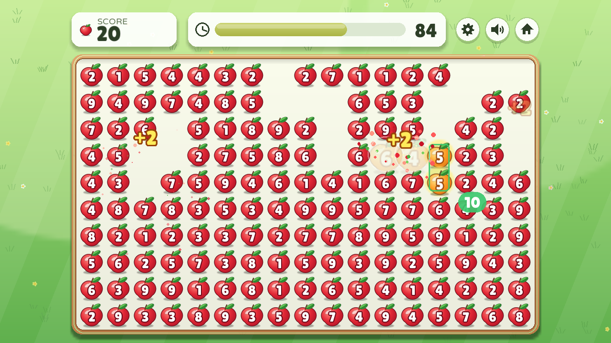
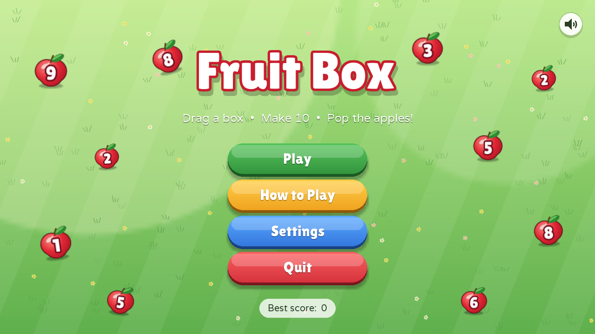
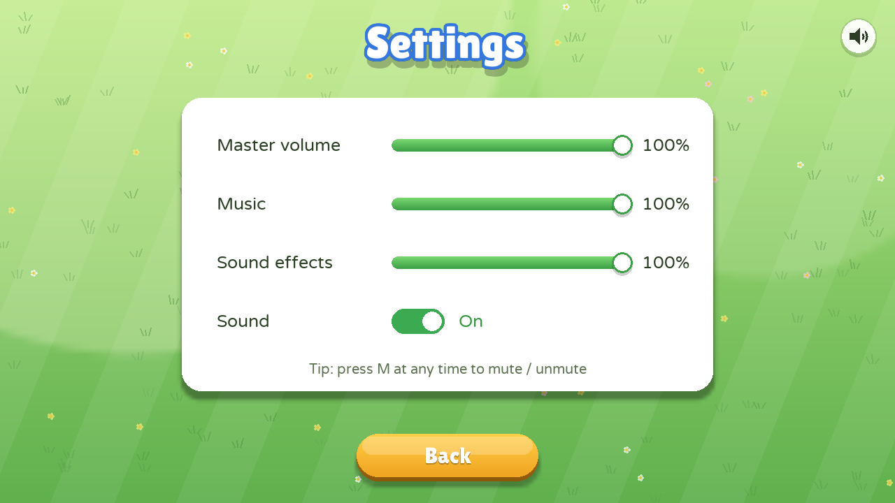
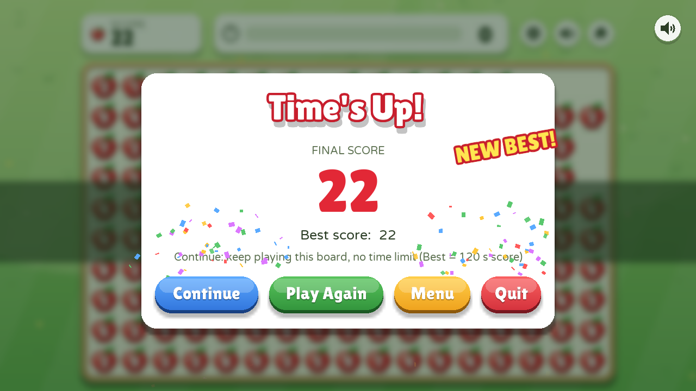

# 🍎 Fruit Box

เกมลากกรอบเลือกแอปเปิลให้ผลรวมได้ **10 พอดี** ภายใน 120 วินาที — Python + pygame-ce



| Menu | Settings | Game Over |
|---|---|---|
|  |  |  |

## เล่นเลย
- **บนเว็บ:** [▶ เล่นในเบราว์เซอร์](https://trymybest888.github.io/fruitbox/) (คลิกหนึ่งครั้งเพื่อเริ่ม)
- **Windows:** โหลด **FruitBox.exe** จาก [Releases](../../releases/latest) แล้วดับเบิลคลิก

## วิธีเล่น
- กดเมาส์ค้างแล้วลากกรอบคลุมแอปเปิล ถ้ารวมได้ 10 แอปเปิลจะหายไป ได้คะแนนตามจำนวนลูก
- หมดเวลาแล้วกด **Continue** เพื่อเล่นกระดานเดิมต่อแบบไม่จำกัดเวลา (High Score นับเฉพาะ 120 วินาทีแรก)
- `ESC` กลับเมนู · `M` เปิด/ปิดเสียง · `F11` เต็มจอ · ปรับระดับเสียงได้ในหน้า **Settings**

## รันจากซอร์ส / Build
```bash
pip install -r requirements.txt
python main.py
```
- Build เป็น `.exe` ไฟล์เดียว: รัน `build.bat` → ได้ `dist\FruitBox.exe`
- Build เวอร์ชันเว็บ (pygbag): `pip install -r requirements-dev.txt` แล้ว `python tools/build_web.py --serve`
  — push ขึ้น `main` แล้ว GitHub Actions จะ build และ deploy ขึ้น GitHub Pages ให้อัตโนมัติ

## เครดิต
ฟอนต์ Lilita One และ Varela Round (SIL OFL) จาก Google Fonts · เสียงทั้งหมดสังเคราะห์ด้วย `tools/make_assets.py`
